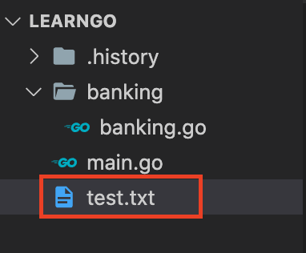

# defer와 panic()

---

## 지연처리 defer

#### 마지막에 꼭 실행하는 defer

- `defer`은 함수 앞에 쓰이는 키워드로써 특정 문장 혹은 함수 내에서 제일 나중에, 끝나기 직전에 실행하게 되는 용법
  > Java로 치면 try ~finally 구문과 유사

Java try, catch문

```js
try {
	메모리 할당 및 구문 실행
} catch {
	예외 처리(논리적 오류)
} finally {
	마지막에 꼭 실행 및 할당된 공간 반납
}
```

- 다른 언어에서 위와같이 사용됨. 보기에도 형식이 확실히 정해져 있어보임
- 하지만 `defer`은 블록이 필요한것도 아니고 특정 위치나 형식이 필요한 것이 아님
- 단지 함수 앞에 `defer`을 명시해주면 됨
- `마지막에 꼭 실행한다`를 쉽게 말하면, 프로그램의 흐름에 분기가 많아 '예외처리'가 많아 복잡할 때 유용하게 사용. `defer`를 사용하면 흐름 중간에 에러(예외)가 발생해도 마지막에 꼭 실행하고 프로그램을 종료하지 않는 것

```js
package main

import "fmt"

func main() {
	defer fmt.Println("world")
    fmt.Println("Hello")
}
```

실행결과

```
Hello
world
```

<br />

### 또 다른 예제

```js
package main

import	"fmt"

func main() {
	var a, b int = 10, 0
	defer fmt.Println("Done")

	result := a / b
	fmt.Println(result)
}
```

실행결과

```
Done
Makefile:6: 'go_run' 타겟에 대한 명령이 실패했습니다
make: *** [go_run] 오류 2
panic: runtime error: integer divide by zero
```

- Go에서는 어떤 수를 0으로 나누면 에러가 발생함
- 코드상으론 문제 없어보이지만 연산을 시작할 때 에러가 발생함
- 이 때 에러가 나고 코드가 바로 종료되는 것이 아니라 defer 구문이 마지막으로 실행되고 종료 됨
- 하지만 만약에 defer구문을 연산 뒤에 넣었을 경우에는 defer구문이 실행 안 됨
- 이러한 기능은 파일을 열고 닫을 때 주로 사용함 (왜냐하면 파일을 열거나 읽어들이면서 에러가 발생하면 파일을 닫을 수 없게 되기 때문)
- 그래서 파일 입/출력에 꼭 필요한 용법

<br />

#### `defer를 사용한 함수들이 여러개면 어떤 함수가 먼저 호출되는걸까?` 에 대한 예제

```js
package main

import "fmt"

func hello() {
	fmt.Println("Hello")
}

func world() {
	fmt.Println("world")
}

func main() {
	defer world()
	hello()

	for i := 0; i <3; i++ {
		defer fmt.Println(i)
	}
}
```

실행결과

```
Hello
2
1
0
world
```

- 자료구조의 스택(LIFO)과 동일한 형태로 출력 됨
- 즉, `제일 나중에 지연 호출한 함수가 제일 먼저 실행됨`

<br />

#### 간단한 파일을 열고 읽어들이는 과정에서 defer 용법을 사용한 예제

```js
package main

import (
	"fmt"
	"os"
)

func Helloworld() {
	file, err := os.Open("test.txt")
	defer file.Close()

	if err != nil {
		fmt.Println(err)
		return
	}

	buf := make([]byte, 1024)

	if _, err = file.Read(buf); err != nil {
		fmt.Println(err)
		return
	}

	fmt.Println(string(buf))
}

func main() {
	Helloworld()
	fmt.Println("Done")
}
```

실행결과

```
open test.txt: no such file or directory
Done
```

- 우선 파일과 관련된 함수를 사용하려면 `os` 패키지를 import 해야함
- `os.Open("test.txt")`를 입력해서 같은 디렉터리에 있는 test.txt 파일을 open
- 여기서 `Open()` 함수는 '파일'과 '에러 값'으로 반환값이 두 개
- 파일을 `file 변수`에 초기화하고 에러 값을 `err 변수`에 초기화
- err 값이 존재하면(nil이 아니라는 말과 동일) 아래에 if문을 실행돼서 err 값을 출력하고 함수 호출을 종료(return).
- 이 때 지연처리 용법이 필요. Helloworld() 함수가 return 되기 전에 defer file.Close() 함수를 실행
- 그래서 프로그램이 오류가 발생하더라도 defer 키워드를 사용해 파일을 닫고 다음 코드를 실행할 수 있는 것

<br />

#### `test.txt`파일 만들고 결과 보기

<p align="center"></p>
test.txt
```
Hello World!
```

실행결과

```
Hello World!
Done
```

<br />

## 종료하는 panic(), 복구하는 recover()

> panic : 겉으로 보이게 아무런 문제가 없는데 실행해보니 에러가 발생해서 프로그램을 종료하는 기능

### `오류`와 `예외`의 차이

- `오류`는 프로그램상 허용하지 않는 문법과 같은 비정상적인 상황에 발생하는 것을 말함
- `예외`는 프로그램이 실행되면서 논리상으로 부적합한 상황이 발생하는 것을 말함

#### 오류가 발생한 예시

```js
package main

import	"fmt"

func main() {
	var num int = 10.5 //문법적인 오류
	fmt.Println(num)
}
```

실행결과

```
./Main.go:6: constant 10.5 truncated to integer
make: *** [cmd] 오류 2
```

#### 예외가 발생한 예시

```js
package main

import	"fmt"

func main() {
	var num1, num2 int = 10, 0
	fmt.Println(num1 / num2) // 나누기 0꼴로 예외 상황
}
```

실행결과

```
Makefile:6: 'go_run' 타겟에 대한 명령이 실패했습니다
make: *** [go_run] 오류 2
```

<br />

#### Panic에 대한 예제

```js
package main

import "fmt"

func panicTest() {
	var a = [4]int{1,2,3,4}

	defer fmt.Println("Panic done")

	for i := 0; i < 10; i++ {
		fmt.Println(a[i])
	}
}

func main() {
	panicTest()

	fmt.Println("Hello, world!")
}
```

실행결과

```
1
2
3
4
Panic done
Makefile:6: 'go_run' 타겟에 대한 명령이 실패했습니다
make: *** [go_run] 오류 2
panic: runtime error: index out of range
goroutine 1 [running]:
panic(0x4db1e0, 0xc82000a0c0)
        /usr/local/go/src/runtime/panic.go:481 +0x3e6
main.panicTest()
        /goorm/Main.go:11 +0x271
main.main()
```

<br />

#### panic함수를 이용한 에러 발생 처리

- panic() 함수를 이용해 예외 상황일때(아무때나 사용할 수 있지만) 직접 panic 에러를 발생시킬수 있음. 여기서 panic() 함수 안에 에러 메시지를 사용자 설정으로 출력할 수 있음

```js
package main

import "fmt"

func main() {
    var opt int
    var num1, num2, result float32

    fmt.Print("1.덧셈 2.뺄셈 3.곱셈 4.나눗셈 선택:")
    fmt.Scan(&opt)
	if opt != 1 && opt != 2 && opt != 3 && opt != 4 {
		panic("1, 2, 3, 4중에 하나만 입력해야합니다!")
	}
    fmt.Print("두 개의 실수 입력:")
    fmt.Scan(&num1, &num2)

    if opt == 1 {
        result = num1 + num2
    } else if opt == 2 {
        result = num1 - num2
    } else if opt == 3 {
        result = num1 * num2
    } else if opt == 4 {
        result = num1 / num2
    }

    fmt.Printf("결과: %f\n", result)
}
```

실행결과

```
1.덧셈 2.뺄셈 3.곱셈 4.나눗셈 선택:5
Makefile:6: 'go_run' 타겟에 대한 명령이 실패했습니다
make: *** [go_run] 오류 2
panic: 1, 2, 3, 4중에 하나만 입력해야합니다!
goroutine 1 [running]:
panic(0x4c3520, 0xc82000a310)
        /usr/local/go/src/runtime/panic.go:481 +0x3e6
main.main()
        /goorm/Main.go:12 +0x277
```

<br />

## panic을 막는 recover() 함수

`recover 함수` : panic 상황이 생겼을 때 프로그램을 종료하지 않고 예외 처리를 하는 것 = try ~catch

```js
package main

import "fmt"

func panicTest() {
	defer func() {
		r := recover() //복구 및 에러 메시지 초기화
		fmt.Println(r) //에러 메시지 출력
	}()

    var a = [4]int{1,2,3,4}

    for i := 0; i < 10; i++ { //panic 발생
        fmt.Println(a[i])
    }
}

func main() {
    panicTest()

    fmt.Println("Hello, world!") // panic이 발생했지만 계속 실행됨
}
```

실행결과

```
1
2
3
4
runtime error: index out of range
Hello, world!
```

### recover() 함수는

- panic이 발생해 프로그램이 종료되는 것을 막고 복구
- 프로그램이 종료되기 전에 실행되어야 함으로 `defer` 가 선언된 함수 안에서 쓰임
- 에러 메시지를 반환. 따라서 변수에 초기화해서 에러 메시지를 출력할 수 있고 변수에 초기화하지 않으면 따로 에러 메시지를 출력하지 않음

#### 재귀함수를 이용한 defer, recover 예제

```js
package main

import "fmt"

func main() {
	defer func() {
		if r := recover(); r != nil{
			fmt.Println(r)

			main()
		}
	}()

	var num1, num2 int
	fmt.Scanln(&num1, &num2)

	result := num1 / num2

	fmt.Println(result)
}
```

실행결과

```
5 0
runtime error: integer divide by zero
0 0
runtime error: integer divide by zero
5 3
1
```

<br />
<br />

## 실습 1 - 엘리베이터

```js
package main

import "fmt"

func main() {
	names := make([]string, 0);
	var name string

	for {
		fmt.Scanln(&name)
		if name == "0" {
			break;
		} else {
			names = append(names, name);
		}
	}

	for _, name := range names {
		defer fmt.Println(name);
	}
}
```

입력값

```
kim
son
lee
0
```

실행결과

```
lee
son
kim
```

<br />

## 실습 2 - 중간고사 평균 점수 2

```js
package main

import "fmt"

func average() float64{
	var num int
	fmt.Scanln(&num)

	if num <= 0 {
		panic("잘못된 과목 수입니다.");
	}


	var score, total int

	for i := 0; i < num; i++ {
		fmt.Scanln(&score)
		if score < 0 {
			panic("잘못된 점수입니다.");
		} else{
			total += score;
		}

	}

	avg := float64(total) / float64(num)

	return avg
}


func main() {
	defer func() {
		err := recover()
		if err != nil{
			fmt.Println(err);
		main();
		}
	}()

	result := average()
	fmt.Println(result)
}
```

입력값

```
0
3
-1
2
1
5
```

실행결과

```
잘못된 과목 수입니다.
잘못된 점수입니다.
3
```
